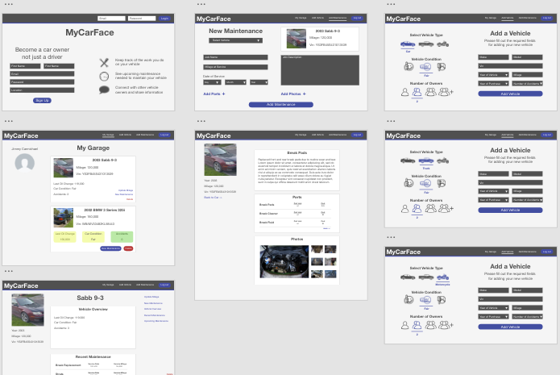

<h1>MyAutoSpace!</h1>

<a href="https://myautospace.herokuapp.com/"> Deployed Application!!</a>

<h1>Description</h1>

MyAutoSpace2 is must have for any home mechanic.The simple interface allows users to document their vehicle histories and keep up with suggested maintenance.

This is a refactor and update on my final project of University of Utah Full-Stack bootcamp. Due to many factors, the final project was not functioning properly.

MyAutoSpace, utilizes a Node.js/Express server side, using MySQL and Sequelize, and JWT in the back-end. The front-end is mostly React.js.

The changes I made from the original project are simple. Before the team used an outdated Firebase package and some PWA functionality. I've taken out the PWA because it was not fully functioning in the desired manner and making the app functioning slower. Firebase was also proving to be problematic, especially being an outdated package.

I am now utilizing AWS S3 photo storage. This has proven to be a much better, more applicable package.

Based on the ending code used, this project is been mostly put together by Ben Knight, with all styling and some refactoring done by George Gombert. Our E-Mails below.

This project has more potential, and fine tuning, that can be expounded upon.

<h1>Table of Contents</h1>

<ul>
<li><a href="#installation">Installation</a></li>
<li><a href="#usage">Usage</a></li>
<li><a href="#faq">FAQ</a></li>
<li><a href="#support">Support</a></li>
<li><a href="#license">License</a></li>
</ul>

<h1>Installation</h1>
<h2>Clone or Download</h2>
<ul>
<li>Clone this repo to your local machine or download zip file</li>
</ul>
<h2>Setup</h2>
<ul>

<li>Fill out connection information for your MySQL database located in the config.json file & nodemon.json</li>
<li>You must create your own AWS storage bucket and database.</li>
<li>Update and install packages</li>
<li>For this project use this command:<code> npm i </code></li>
</ul>

<h1>Usage</h1>

<h1>FAQ</h1>

<ul>
<li><strong>How do I add create an account?</strong>
<ul>
<li>Complete the Sign Up Form. Wait for your image Upload to complete then click signup </li>
</ul>
</ul>

<ul>
<li><strong>How do I add my vehicle?</strong>
<ul>
<li>Log in and click Add Vehicle. </li>
</ul>
</ul>

<h1>Support</h1>

Reach out to us! 
<ul>
<li>GitHub Email: ben.knight.brazil@hotmail.com</li>
<li>GitHub Email: georgegombert@gmail.com</li>
</ul>

<h1>License</h1>

<ul>
<li>License:<code>MIT</code></li>
</ul>